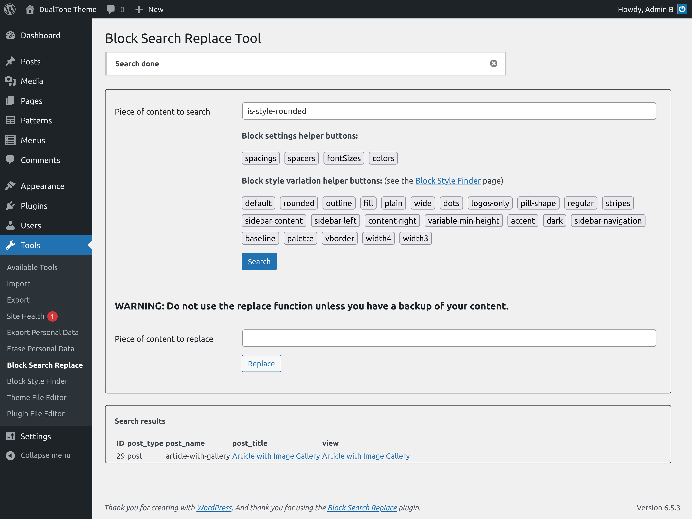

# Block Search Replace Tool

Adds an admin page inside the tools menu option with the functionality to perform search & replace actions over blocks that may be found in the content of a site.

If you know block markup, this plugin may be very useful helpong you find the pices of content that have a certain markup on them.

If you have included a certain block, a number of time, like a spacer 100px high and you want to replace it by one just 40px high, for instance, you may perform the replacement in all your content as long as you are very careful with it and have a complete backup of your content.

For the moment the search replace functionality works but for content with just one line. For multiple lines replacements, you would have to perform multiple search replace actions.

The search replace tool has some helper buttons that let you perform quick searches on frequently used block markup settings and on custom block style variations. You can even go to a second page where you will have a list of all the custom block style variations that you have: the default ones and the ones provided by your active theme.

## Changelog

= 0.6.0 =
* fixes after running plugin check

= 0.5.0 =
* Added README.md and LICENSE
* Added screenshots
* Added some more styles and readme text

= 0.0.4 =
* Add version of style & scripts from plugin data

= 0.0.3 =
* Add max height and scroll y to content item

= 0.0.2 =
* Remove revisions from search and replace
* Activate replacement (just one line of content)

= 0.0.1 =
* Initial vesion released WIP
